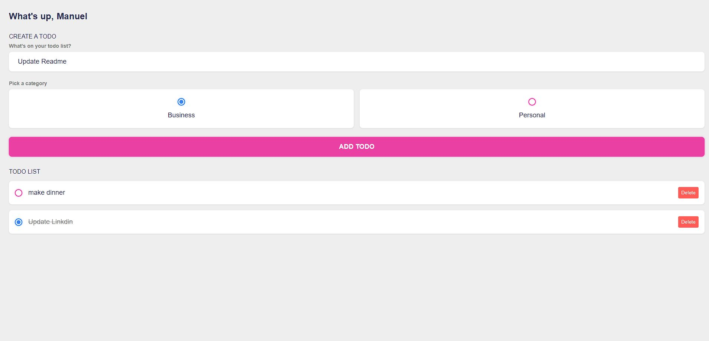

<h1>TODO LIST Vanilla.JS</h1>

A simple To-Do List with Vanilla.JS

<h1>Run the Project</h1>

To run this project on your PC you need to follow these steps:

Clone this repository
Open the code on your IDE
Run code using 'npm run dev'

